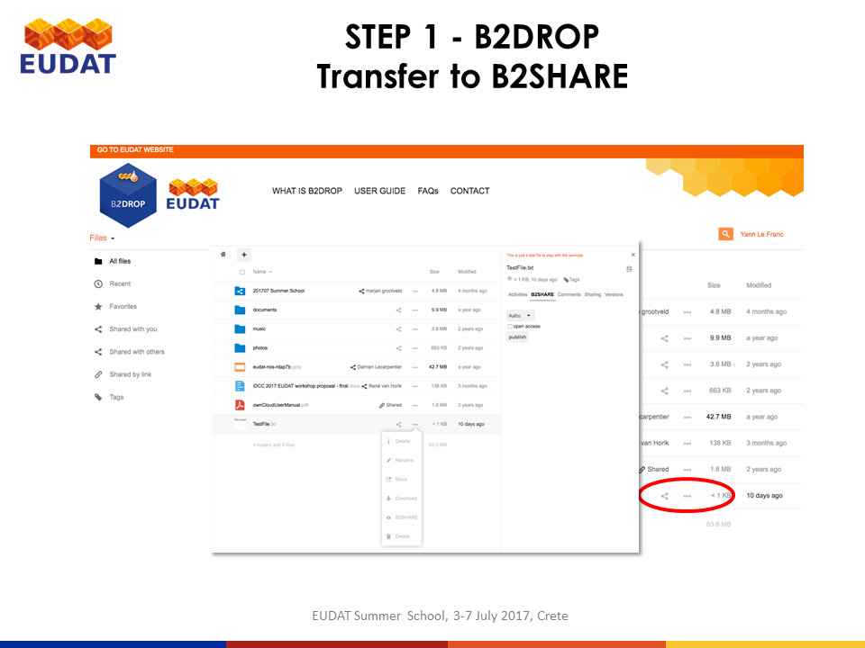

# Usage of B2SHARE
This document describes how to register and login in B2SHARE in order to upload, share and transfer files to B2SHARE . 

## Prerequisites

### 1. Internet connection and browser 
with Java Script enabled. 

Supported and tested are
1. Firefox, version 45 or later
2. Google Chrome, version 51 or later
(There are known problems by using Windows 10's Internet Explorer
and Safari is not tested yet)

### 2. Access to https://trng-b2share.eudat.eu/
We use here the training instance of B2SHARE, accessible at https://trng-b2share.eudat.eu/

## Step by step workflow

## 1. Register and login

Before you can use the B2SHARE service you have first to register via B2ACCESS as shown in sub following figures :

If you don't have registered yet, click please on 'Register' in the front page of https://trng-b2share.eudat.eu.

This redirects you to the B2ACCESS front page where you can choose between two options to register :
 1. Log in with one of your social ID's. Supported the 'identity providers'  facebook, github, google or Windows. If you have an account of one of these you can choose this option ...
 2. Just click on 'Register a new account' 

## 2. The main user interface 
After login you will get to the user interface where you can browse for files and .. :

## 3. Transfer file to B2SHARE
You can now transfer the uplaoded file to the B2SHARE repository.

## 4. Upload a file to B2SHARE
To upload a file to B2SHARE

## 5. 

