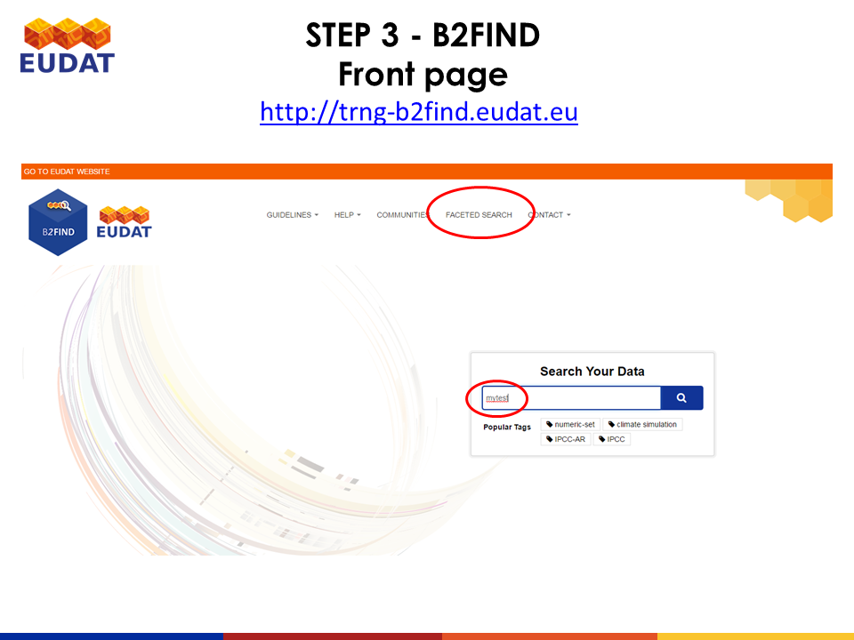
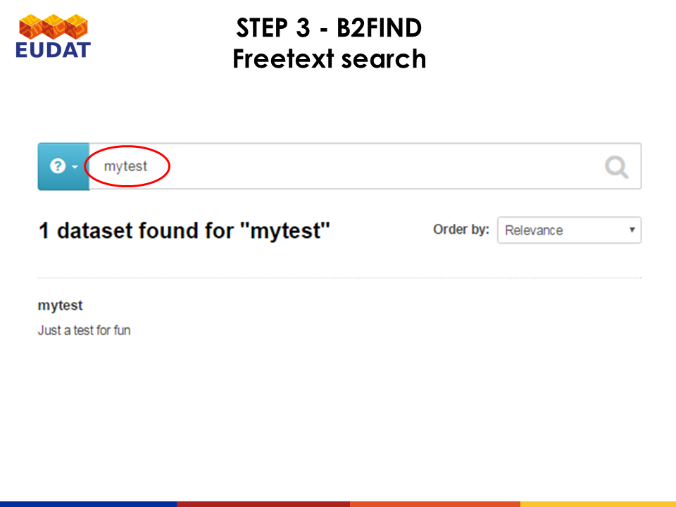
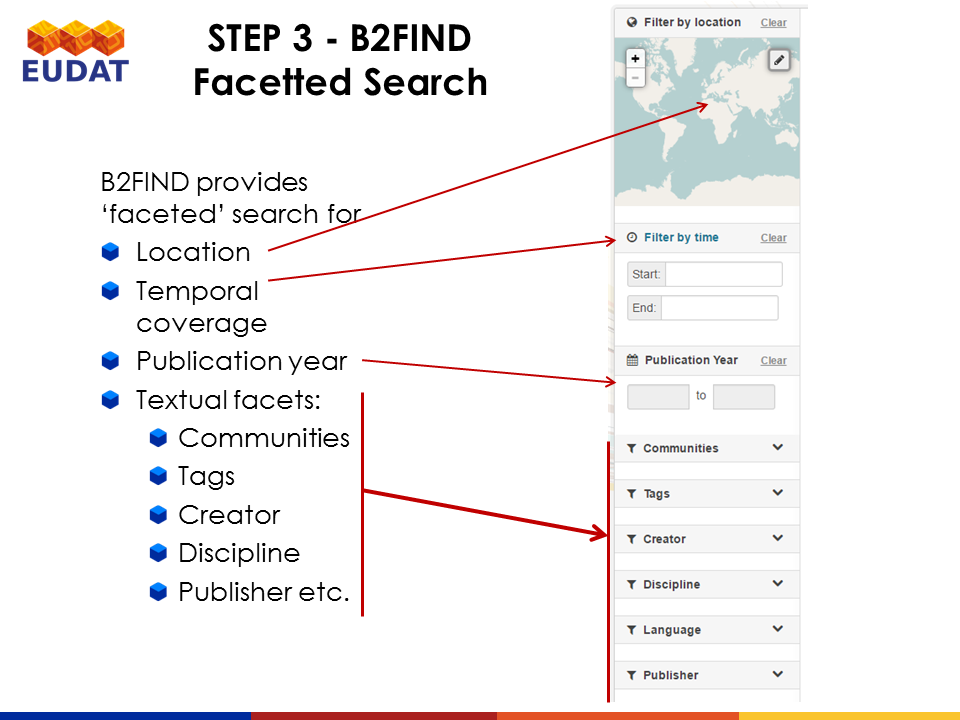
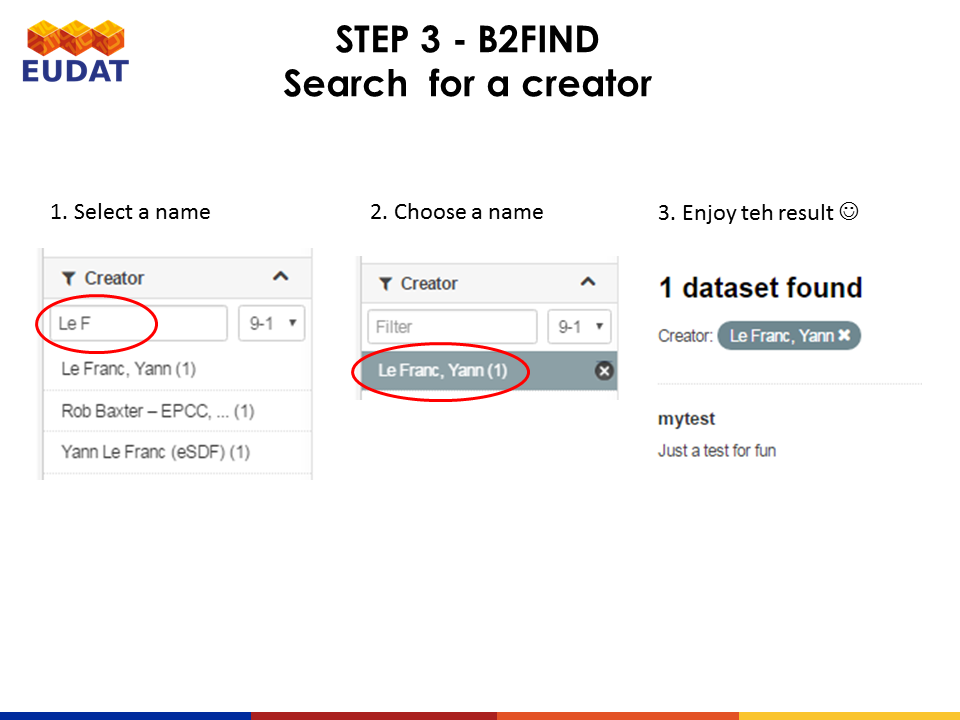
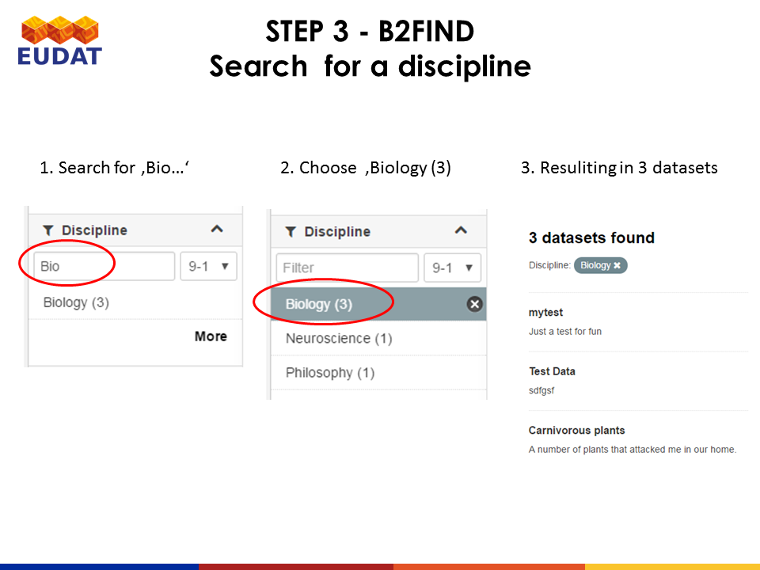
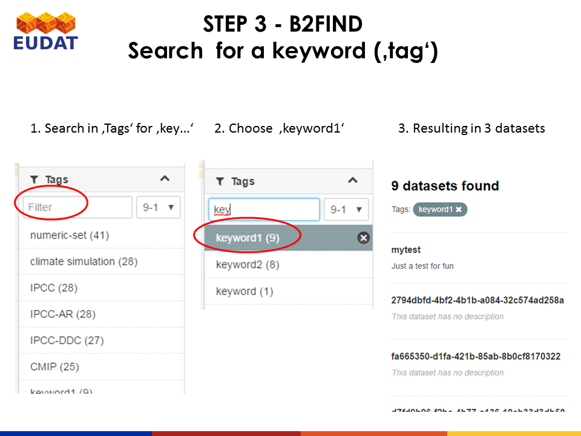
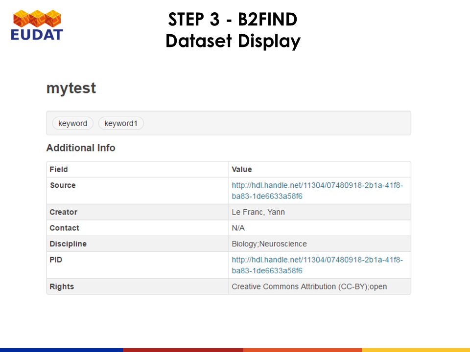
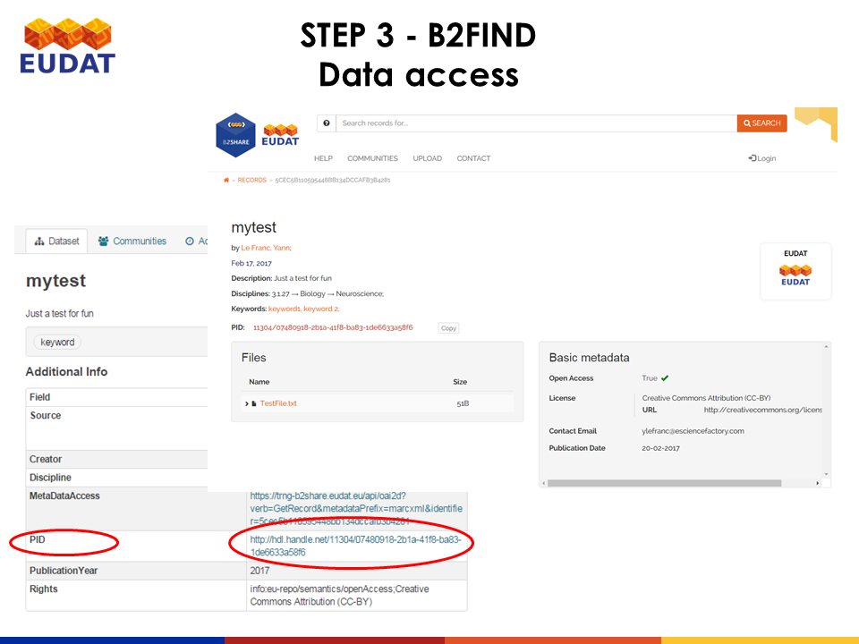
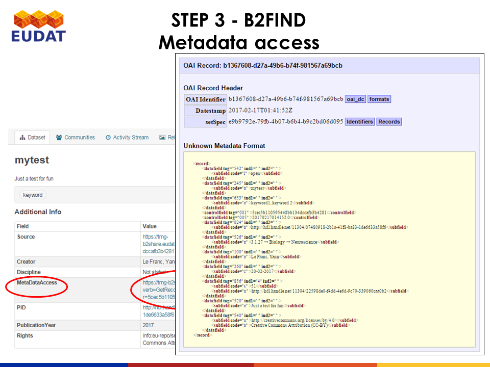

# Usage of B2FIND
This document describes how you can search in B2FIND and find the to B2SHARE uploaded data . 

## Environment
Internet connection and browser 
with Java Script enabled. 

Supported and tested are
1. Firefox, version 45 or later
2. Google Chrome, version 51 or later
(There are known problems by using Windows' Internet Explorer

## 1. The main user interface 

We use here the training instance of B2FIND accessible at http://trng-b2find.eudat.eu . The entry page is shown in figure 1.

Directly from there you can submit a free text search.

## 2. Faceted search
If you click on `FACETED SEARCH` you can filter for several fields, as shown in figure 3 :

For example you can use the auto complete functionality of the facet `Creator` to choose the Createor `Le Franc, Yann` :

If you select all datasets that are associated by the `Discipline` *Biology*, three entries are found. 

to search for keywords - called `Tags` in the B2FIND portal - is as well possible. In the shown example nine datasets that are tagged with the keyword *keyword1* are listed.

## 3. Dataset Display
By clicking on one of the listed entries, the metadata of the associated dataset is displayed :

....

## 4. Data Access
B2FIND provides several types of identifiers (`DOI`, `PID`, `Source`),
whereby at least one of them must provide. In ousr example of the dataset `mytest` leads `PID` directly to the B2SHARE dataset.

The originally harvested metadata, in our case a MarcXML file, is displayed :
