# Usage of B2NOTE
This document describes how to register and login in B2NOTE in order to create and search for annotations . 

## Environment
Internet connection and browser 
with Java Script enabled. 

Supported and tested are
1. Firefox, version 45 or later
2. Google Chrome, version 51 or later
(There are known problems by using Windows' Internet Explorer

## 1. Register and login

Before you can use the B2NOTE service you have first to register as shown in figure 1.

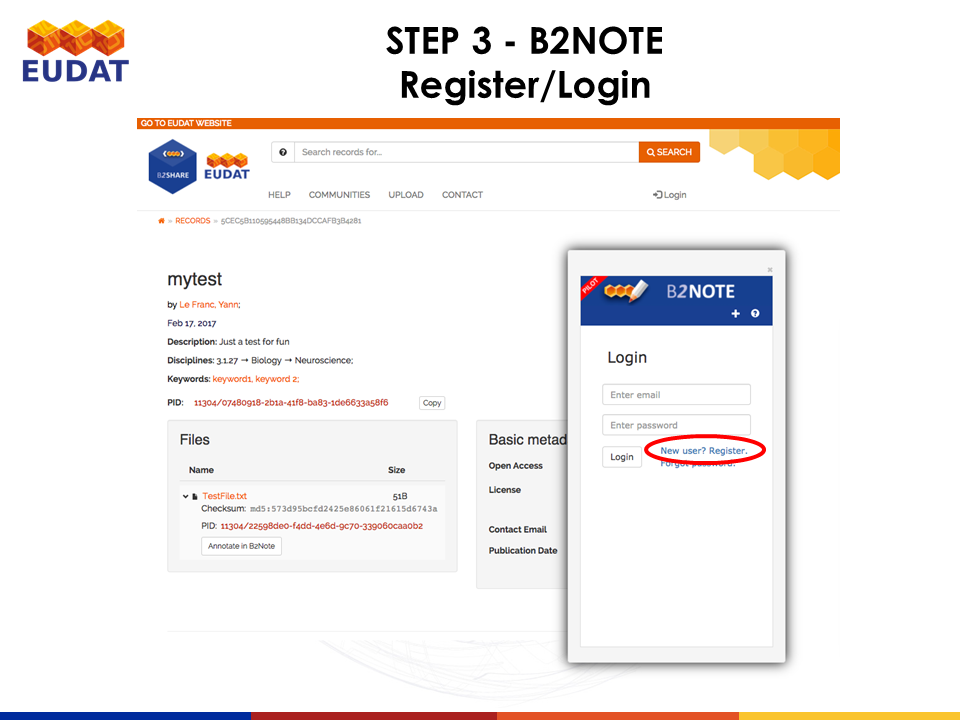

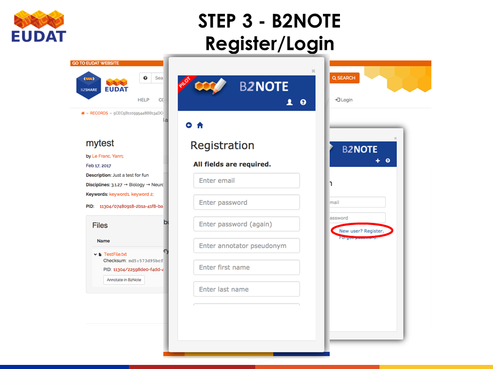

## 2. Create an annotaion
After login you can now create an annotation by clicking ofn 'Craete annotation' of a dataset :

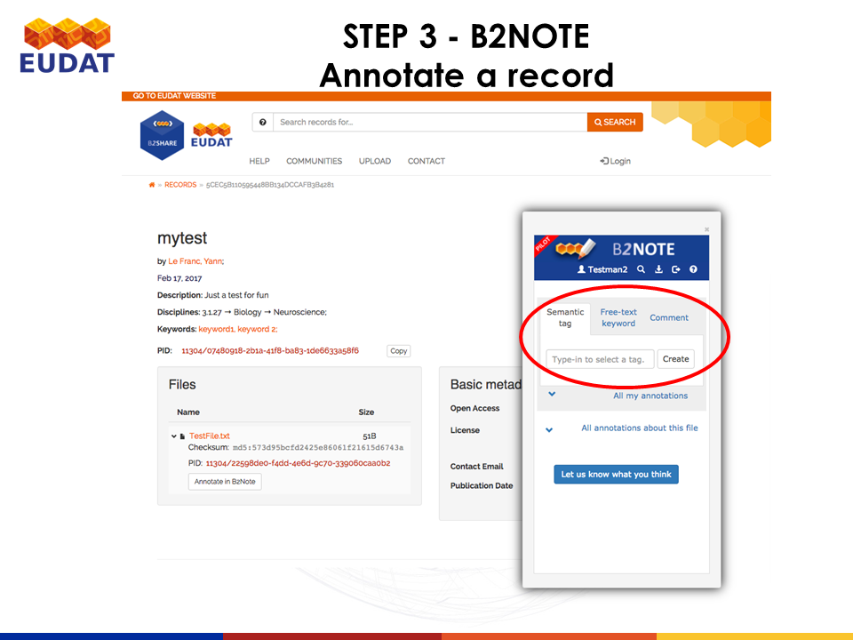
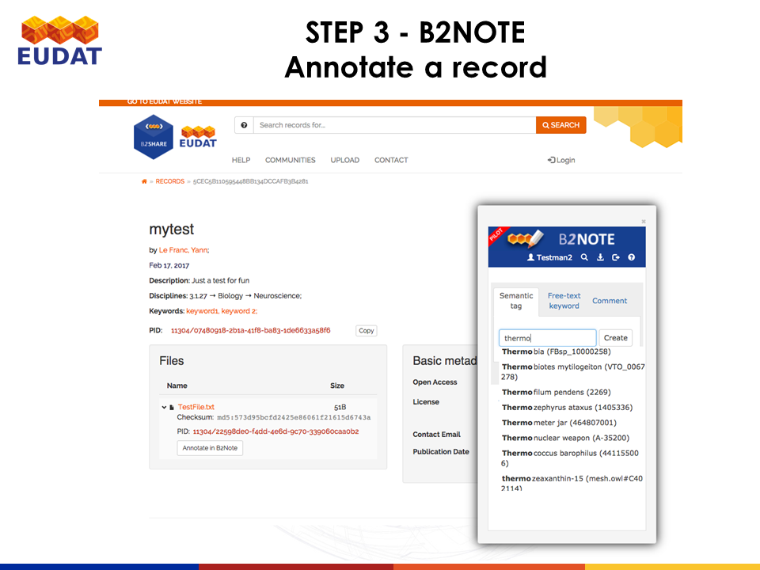
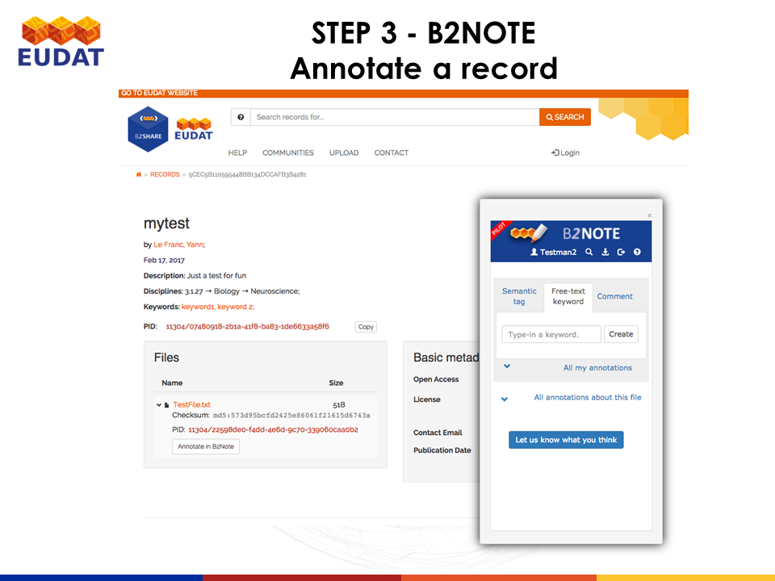
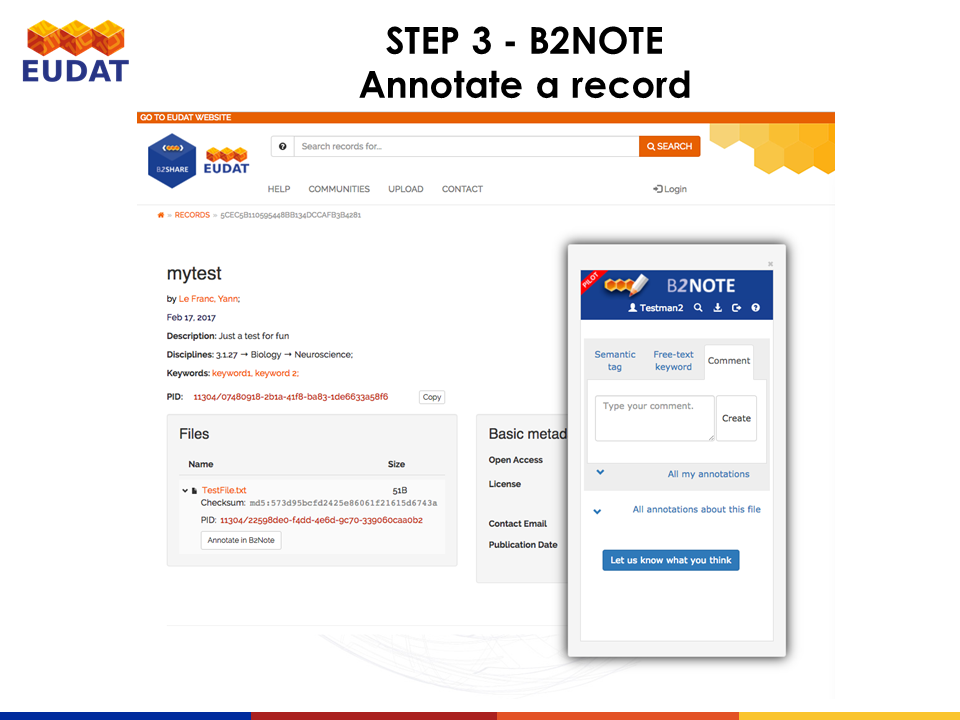
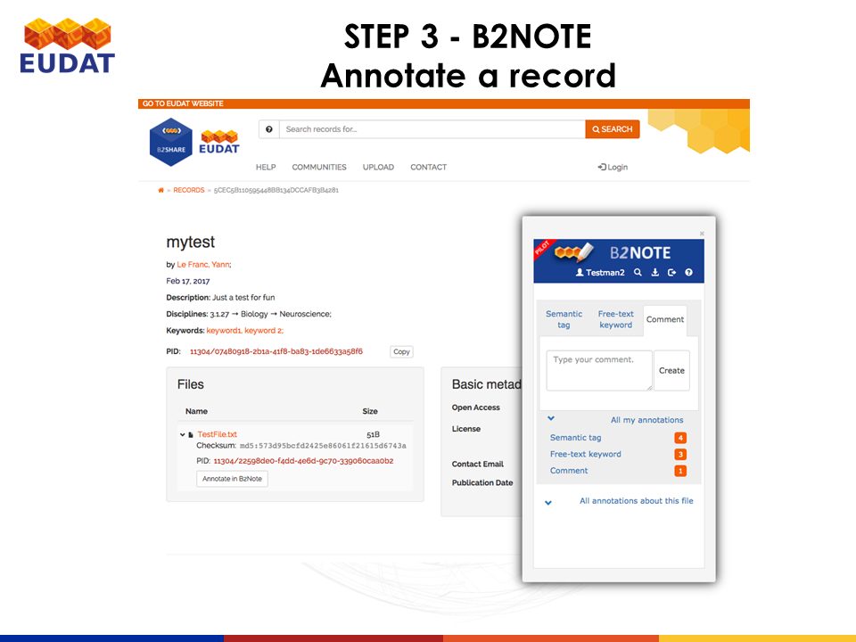
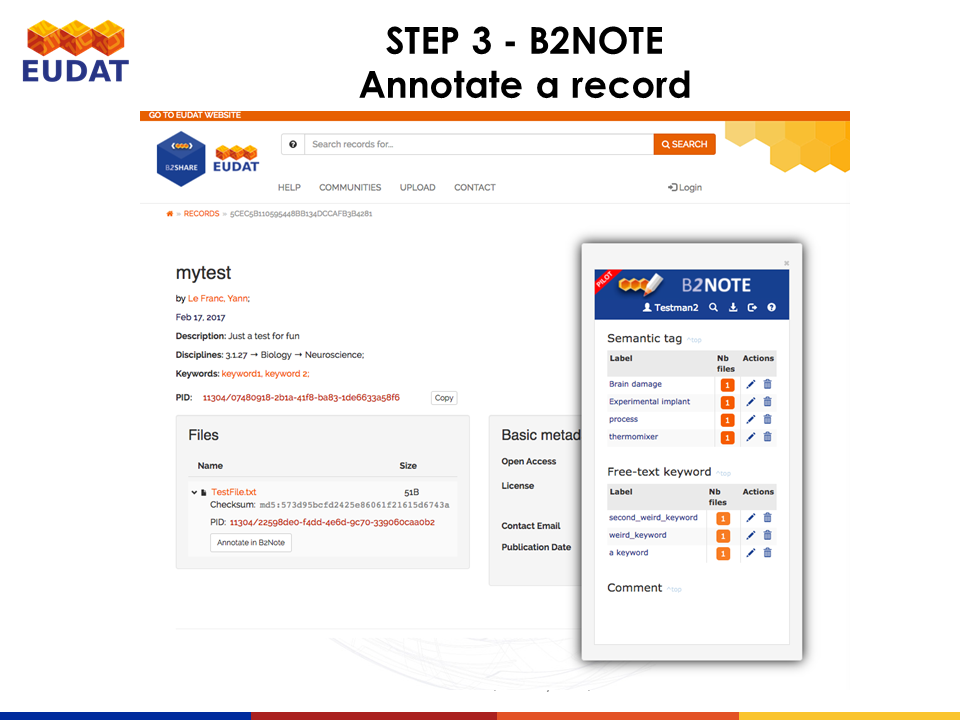
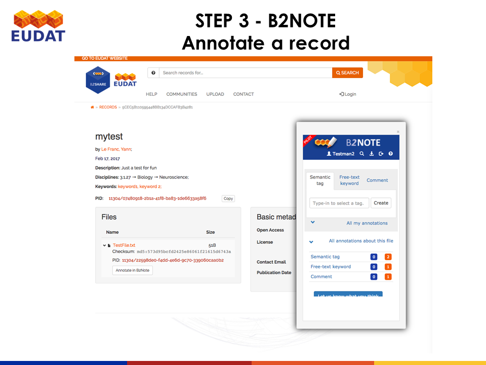
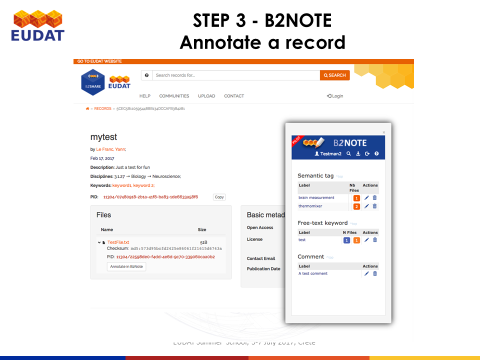

## 3. Retrieve a record
You can now search in the B2NOTE interface for annotated records.

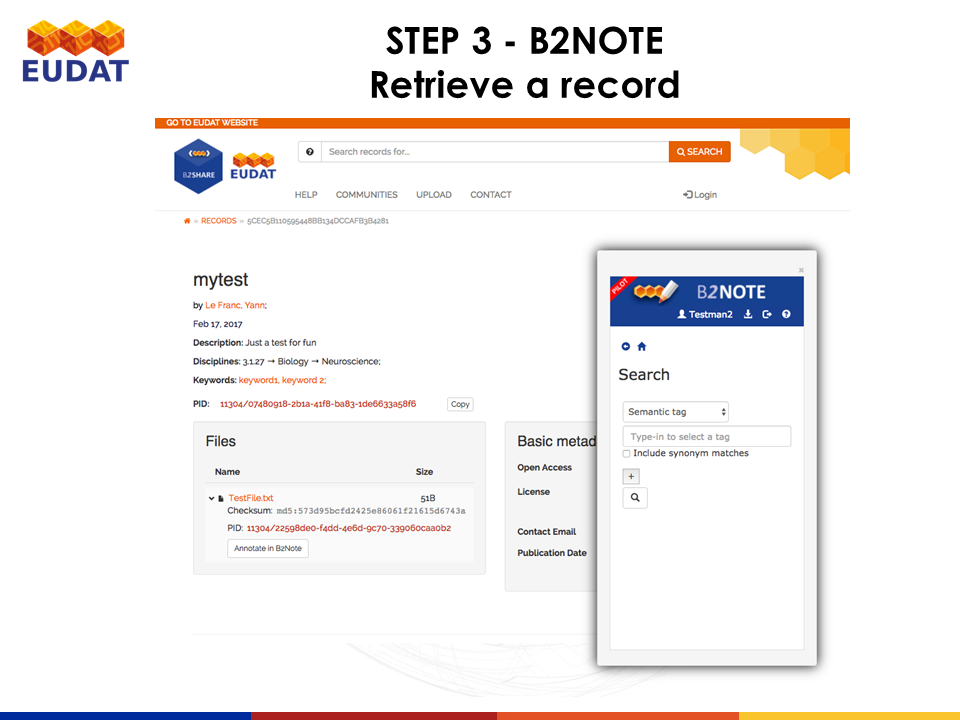
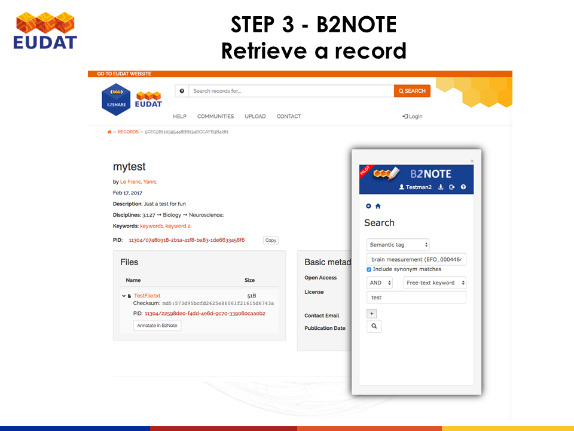
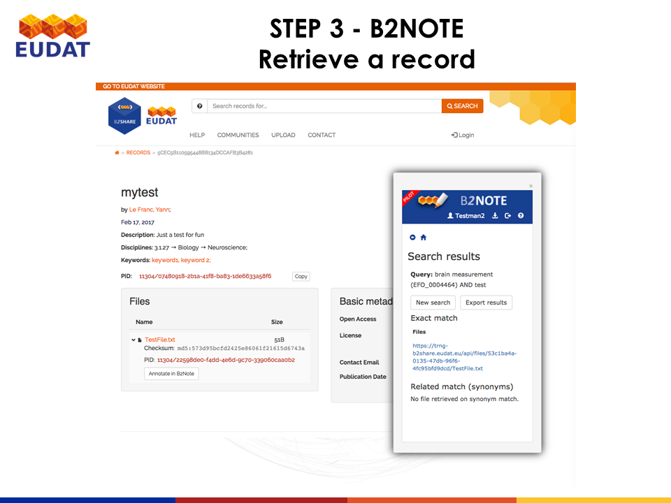
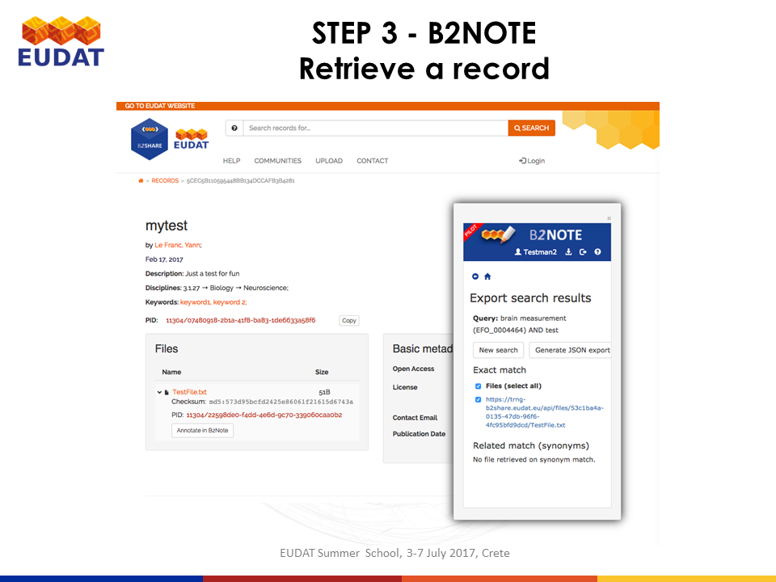
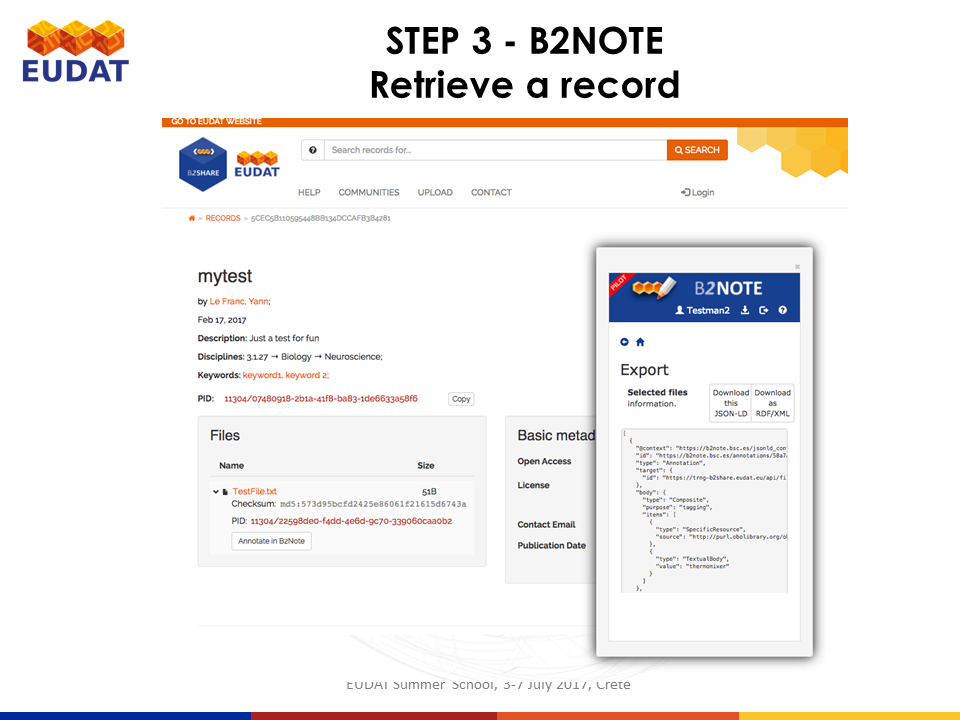