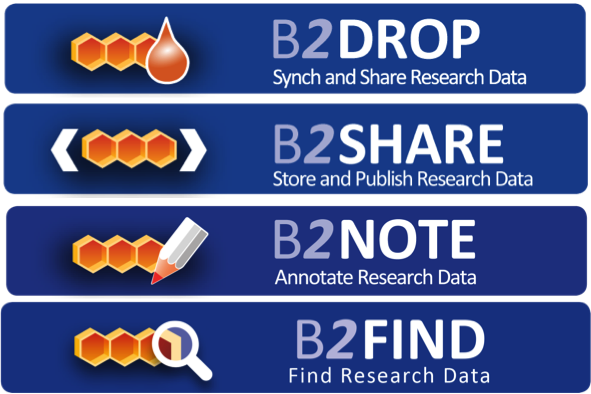

# B2DROP-B2SHARE-B2NOTE-B2FIND training
**An example workflow for data management**

## Contents
This training module takes you through an example workflow for data management. You will use **B2DROP** as a workspace environment, where you can create, change and delete data files. We will investigate how this data can be published directly in **B2SHARE** i.e. how to create appropriate metadata and subsequently publishing the metadata and the data in a B2SHARE record. Once data is published, it cannot be revised easily. The **B2NOTE** service is made for annotating published data with extra metadata. Based on the created metadata in B2SHARE you can search and retrieve data through EUDAT's metadata platform **B2FIND**.
