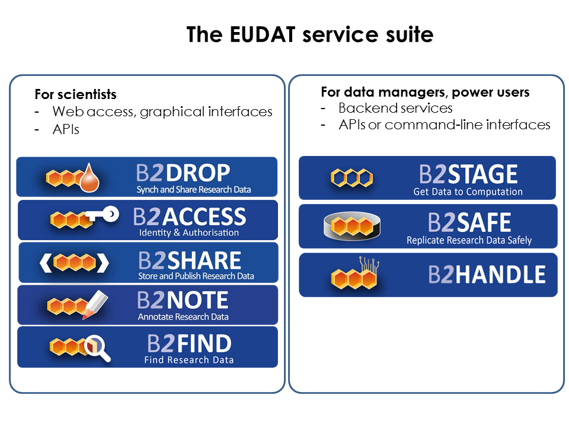

##
##**`UNDER CONSTRUCTION`** **`This training material is under construction, please use with care`** **`UNDER CONSTRUCTION`**

# B2DROP-B2SHARE-B2NOTE-B2FIND training
**An example workflow for data management**

<!-- can be removed (HEW)

-->

## Contents

This training module takes you through an example workflow for data management. You will use **B2DROP** as a workspace environment, where you can create, change and delete data files. We will investigate how this data can be published directly in **B2SHARE**, i.e. how to create appropriate metadata and subsequently publishing the metadata and the data in a B2SHARE record. Because you have need an user account to upload files to B2SHARE, we explain how to register and login via **B2ACCESS** at B2SHARE. Based on the created metadata in B2SHARE you can search and retrieve data through EUDAT's metadata platform **B2FIND**. Once data is published, it cannot be revised easily. The **B2NOTE** service is made for annotating published data with extra metadata. 

<!--
In figure 1 the entire EUDAT service suite is shown, while we focus in this training course on the services 'For scientists' as listed on the left hand side. To follow this only internet access via a web browser are needed and only graphical user interfaces and some API's are used. 

( In case you are - as a data manager - are interested in the backend services on the right hand side, we refer to the training material  [B2SAFE-B2STAGE-Training](https://github.com/EUDAT-Training/B2SAFE-B2STAGE-Training). )
-->

The ideal workflow is shown in figure 1.

Figure 2 shows how the situation is at the moment, i.e. how the EUDAT services can used right now.

But in this training course we use for simplicity a little bit streamlined workflow as shown in figure 3 :

## Target audience

The EUDAT services can be divided in two main groups of users :
* those who want to **use** the EUDAT B2FIND service, i.e. scientists who want to share, store, search and access research data.
* those who want to learn how to **integrate** backend services as B2STAGE, B2SAVE and B2HANDLE, i.e. data managers or power users who want to preserve and replicate big data long term or set up sophisticated workflows to process multiple files on HPC platforms. 
This division is shown in figure 4

In the present training course we deal exclusively on the 'scientist' workflow.
( In case you are - as a data manager - are interested in the backend services on the right hand side, we refer to the training material  [B2SAFE-B2STAGE-Training](https://github.com/EUDAT-Training/B2SAFE-B2STAGE-Training). )

## Submodules

The order and numbering of the submodules in the table below follow the curriculum of the training as shown in figure 3 above. Each component takes about 0.5 to 1.0 hours.

| #    | Submodule            |
|-----|----------------------|
| 01 | [B2DROP](01-b2drop.md)  |
| 02 | [B2SHARE](02-b2share.md)  |
| 03 | [B2FIND](03-b2find.md)  |
| 04 | [B2NOTE](04-b2note.md)  |
 
## The Use case
....

